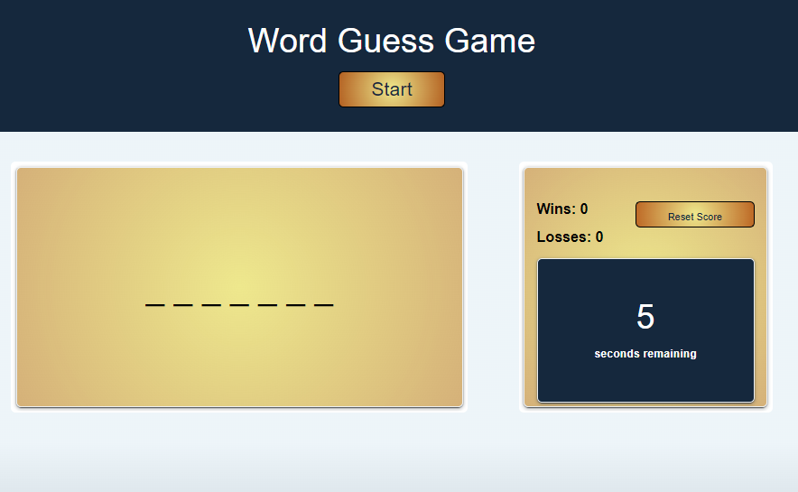
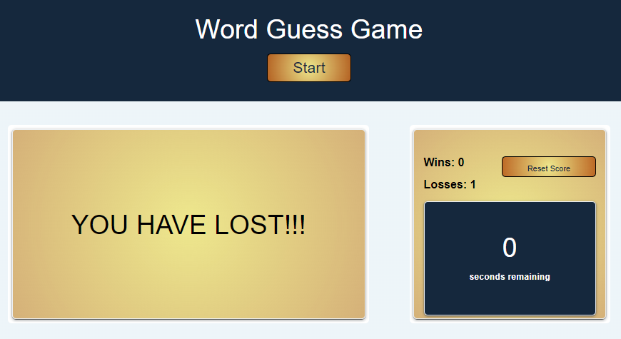
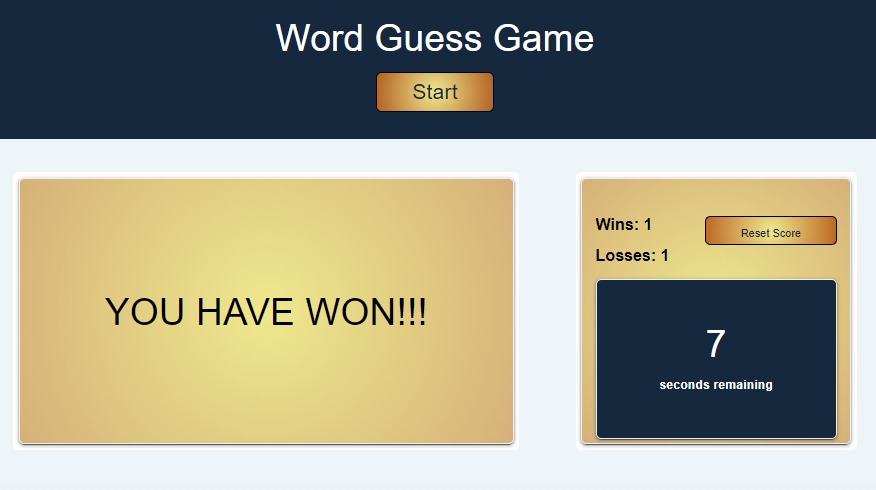

# Word Guessing Game

## Description

This Word Guessing Game was created so that users are able to guess words against a timer and are able to keep track of their wins and losses.

## Installation

Run the index.html file.

## Usage

- Start the game by pressing the "Start" button in the top of the page.
- Begin typing letters and fill out the blank spots.
- If you are able to guess the word, your Win counter will increase, if you lose, your losses counter will increase.
- You are able to reset your score by pressing the "Reset Score" button.

    
    
    
    
    

## License

MIT License.

## Features

- Uses HTML, CSS, JavaScript, DOM (Document Object Model), and utilizes local storage to store wins and losses.
- Timer interval, wins and losses counter, start button, reset button, user input to play game.
